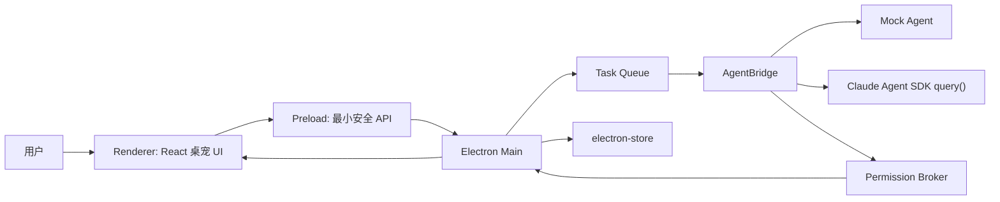

# Virtual Assistant

> **项目名称**：Virtual Assistant  
> **目标**：构建一个 Windows 本地运行的桌面宠物式 AI 助手。它以透明置顶桌宠作为入口，通过动画、气泡、输入面板和确认按钮展示 AI Agent 的状态，并把用户任务转交给 Claude Agent SDK 执行。  
> **当前阶段**：本地 MVP 验证，不考虑发布商店、云同步、多用户账号或复杂插件市场。

---

## 0. 可行性审视与修订结论

### 0.1 总体判断

该方案可行，适合先做本地 MVP。但原方案中有三个需要立即修正的问题：

1. **SDK 名称和调用方式需要更新**  
   当前官方文档使用 `@anthropic-ai/claude-agent-sdk`，核心接口是 `query()` 返回异步消息流，而不是 `@anthropic-ai/claude-code` 的 `new ClaudeCode()` 事件监听模型。

2. **权限确认不应模拟不存在的 `permission_required` 事件**  
   应使用 Claude Agent SDK 的 `canUseTool` 回调，把工具执行请求转成渲染进程里的确认气泡。用户点击允许/拒绝后，主进程返回 `{ behavior: "allow" }` 或 `{ behavior: "deny" }`。

3. **桌宠 UI 和 Agent 执行层必须解耦**  
   成熟本地 Agent 项目普遍把 UI、执行环境、权限边界分开。OpenHands 推荐 Docker sandbox，Process/Local 模式被明确标注为没有隔离；Open Interpreter 也强调运行本地代码前需要用户确认。Virtual Assistant 的 MVP 可以先本地直连，但必须保留“工作目录范围、工具白名单、确认队列、操作日志”这些安全边界。

### 0.2 参考到的成熟方案要点

- Claude Agent SDK：Agent loop 会流式产生 system、assistant、user、result 等消息；工具调用和结果在消息流中体现，最终结果由 `result` 消息给出。官方还提供 `permissionMode`、`allowedTools`、`disallowedTools`、`canUseTool` 等权限控制。
- Electron：透明无边框窗口、托盘、全局快捷键都适合实现桌宠外壳；但需要保持 `contextIsolation: true`、`nodeIntegration: false`，并用 preload 暴露最小 IPC API。
- Open Interpreter / OpenHands 类产品：共同经验是“本地执行能力越强，权限边界越重要”。MVP 先限定到项目目录和明确工具确认，比一开始做全桌面自动化更稳。

### 0.3 本文档的修订方向

本方案将项目正式命名为 **Virtual Assistant**，并把实现路线调整为：

1. 先做 Electron 桌宠壳层和状态 UI。
2. 再做 Mock AgentBridge，验证状态、气泡、确认、队列。
3. 最后接入 Claude Agent SDK 的 `query()` 流式消息与 `canUseTool` 权限回调。
4. Skill 部分只作为未来扩展，不作为 MVP 阻塞项；若找不到对应 skill，直接跳过。

---

## 1. 技术栈与核心依赖

| 层 | 技术 | 建议版本 | 说明 |
| --- | --- | --- | --- |
| 桌面框架 | Electron | 28+，实际用模板当前稳定版 | 透明窗口、系统托盘、全局快捷键 |
| 前端 | React + TypeScript | React 18+ | 桌宠 UI、输入面板、气泡 |
| 构建 | electron-vite + Vite | 使用模板默认稳定版本 | 本地开发体验好 |
| 状态管理 | Zustand | 4+ / 5+ 均可 | 管理宠物状态、任务状态、确认弹窗 |
| 动画 | Lottie 或 PixiJS | MVP 优先 Lottie | 初期可用 CSS/占位图替代 |
| Agent SDK | `@anthropic-ai/claude-agent-sdk` | 最新稳定版 | 通过 `query()` 获取流式消息 |
| 配置持久化 | electron-store | 最新稳定版 | 保存窗口位置、工作目录、权限偏好 |
| 打包 | electron-builder | 24+ | 后续生成 Windows 安装包 |

---

## 2. MVP 功能范围

- [ ] 透明、置顶、无边框、可拖动的桌面宠物窗口。
- [ ] 系统托盘图标，支持显示、隐藏、退出。
- [ ] 宠物至少具备 5 个状态：`idle`、`thinking`、`working`、`alert`、`error`。
- [ ] 对话气泡可显示文本、工具调用摘要、错误和确认按钮。
- [ ] 点击宠物或使用快捷键打开输入面板。
- [ ] 主进程维护单任务执行队列，避免多任务并发互相踩踏。
- [ ] 渲染进程通过 preload 暴露的安全 IPC 与主进程通信。
- [ ] AgentBridge 支持 Mock 模式和 Claude SDK 模式。
- [ ] 权限确认流程：工具调用需要确认时，桌宠显示确认气泡；用户允许/拒绝后回传 SDK。
- [ ] 操作日志：至少记录任务开始、工具名、是否允许、任务结束、错误。
- [ ] 工作目录限制：MVP 默认只允许 Agent 操作当前项目目录。

暂不纳入 MVP：

- 语音唤醒、ASR/TTS。
- 全桌面 GUI 自动点击。
- 剪贴板主动监听。
- 自动学习工作流。
- 插件/skill 市场。
- 云同步和远程控制。

---

## 3. 推荐架构



核心原则：

- Renderer 只负责 UI，不直接接触 Node、文件系统或 API Key。
- Main 负责窗口、托盘、快捷键、任务队列、配置、日志。
- AgentBridge 负责把 SDK 消息归一化成 UI 可理解的状态事件。
- Permission Broker 负责把 `canUseTool` 请求转成用户确认，并等待用户响应。

---

## 4. 项目初始化

建议项目目录仍然使用当前仓库根目录 `Virtual Assistant`，内部包名可用小写短横线：

```bash
npm create electron-vite@latest . -- --template react-ts
npm install
npm install @anthropic-ai/claude-agent-sdk zustand lottie-react electron-store
npm install -D electron-builder
npm run dev
```

如果模板不允许在非空目录初始化，可先在临时目录创建，再把文件迁入当前目录。

---

## 5. 模块设计

### 5.1 主进程

主进程职责：

- 创建透明桌宠窗口。
- 注册托盘菜单。
- 注册全局快捷键。
- 初始化 `AgentBridge`。
- 注册 IPC：`agent:run`、`agent:permission-response`、`window:move-by`、`settings:*`。
- 在应用退出前注销快捷键。

关键注意：

- `globalShortcut.register()` 会在快捷键被占用时返回 `false`，必须记录或提示。
- 应监听 `app.on("will-quit")` 并调用 `globalShortcut.unregisterAll()`。
- 开发环境加载 Vite URL，生产环境加载本地 HTML。

### 5.2 透明窗口

窗口配置建议：

```ts
const win = new BrowserWindow({
  width: 320,
  height: 380,
  transparent: true,
  frame: false,
  alwaysOnTop: true,
  resizable: false,
  skipTaskbar: true,
  hasShadow: false,
  webPreferences: {
    preload: join(__dirname, "preload.js"),
    nodeIntegration: false,
    contextIsolation: true,
    sandbox: false
  }
});
```

拖动优先使用主进程 `setPosition()` 加 IPC 实现。后续如果形状稳定，可以进一步研究 `setIgnoreMouseEvents(true, { forward: true })` 实现透明区域穿透。

### 5.3 Preload API

preload 只暴露白名单方法：

```ts
contextBridge.exposeInMainWorld("virtualAssistant", {
  runAgent: (prompt: string) => ipcRenderer.invoke("agent:run", prompt),
  respondPermission: (id: string, allowed: boolean) =>
    ipcRenderer.send("agent:permission-response", { id, allowed }),
  moveBy: (dx: number, dy: number) =>
    ipcRenderer.send("window:move-by", { dx, dy }),
  onAgentEvent: (callback: (event: AgentUiEvent) => void) => {
    const listener = (_: unknown, event: AgentUiEvent) => callback(event);
    ipcRenderer.on("agent:event", listener);
    return () => ipcRenderer.removeListener("agent:event", listener);
  },
  onToggleInput: (callback: () => void) => {
    const listener = () => callback();
    ipcRenderer.on("ui:toggle-input", listener);
    return () => ipcRenderer.removeListener("ui:toggle-input", listener);
  }
});
```

注意：监听方法要返回 unsubscribe，避免 React 热更新或组件重挂载造成重复监听。

### 5.4 统一 UI 事件

建议定义统一事件，不让 UI 依赖 SDK 原始消息：

```ts
export type AgentUiState = "idle" | "thinking" | "working" | "alert" | "error";

export type AgentUiEvent =
  | { type: "state"; state: AgentUiState; message?: string }
  | { type: "tool"; toolName: string; summary?: string }
  | { type: "permission"; id: string; toolName: string; input: unknown; message: string }
  | { type: "result"; message: string; sessionId?: string; costUsd?: number }
  | { type: "error"; message: string };
```

### 5.5 AgentBridge

AgentBridge 需要两种实现：

1. `MockAgentBridge`：不依赖网络和 API Key，用定时器模拟状态流。
2. `ClaudeAgentBridge`：接入 `@anthropic-ai/claude-agent-sdk`。

MVP 先实现 Mock，再替换真实 SDK。这样可以先把桌宠体验跑通。

Claude SDK 接入方向：

```ts
import { query } from "@anthropic-ai/claude-agent-sdk";

async function runClaudeTask(prompt: string) {
  for await (const message of query({
    prompt,
    options: {
      cwd: projectCwd,
      permissionMode: "default",
      allowedTools: ["Read", "Glob", "Grep"],
      disallowedTools: ["Bash(rm *)"],
      canUseTool: async (toolName, input) => {
        const allowed = await permissionBroker.ask({ toolName, input });
        return allowed
          ? { behavior: "allow" }
          : { behavior: "deny", message: "用户拒绝了该操作", interrupt: true };
      }
    }
  })) {
    handleSdkMessage(message);
  }
}
```

`handleSdkMessage()` 的职责是根据 `message.type` 解析：

- `system`：初始化或恢复会话，UI 可进入 `thinking`。
- `assistant`：解析文本块和工具调用块，UI 显示思考/工作状态。
- `user`：工具结果回传，可更新工具输出摘要。
- `result`：任务完成，UI 回到 `idle` 并展示结果。
- 其他观测事件：先记录日志，必要时再映射到 UI。

### 5.6 权限确认

权限确认必须在主进程维护 pending map：

```ts
type PendingPermission = {
  resolve: (allowed: boolean) => void;
  createdAt: number;
};

const pendingPermissions = new Map<string, PendingPermission>();
```

流程：

1. SDK 触发 `canUseTool(toolName, input)`。
2. 主进程生成 permission id。
3. 主进程发送 `agent:event` 的 `permission` 事件到渲染进程。
4. 渲染进程显示确认气泡。
5. 用户点击允许/拒绝。
6. 主进程根据 id resolve。
7. 若超时未响应，默认拒绝。

建议默认需要确认的操作：

- `Bash`。
- `Write` / `Edit`。
- 任何涉及项目目录外路径的操作。
- 任何包含删除、移动、覆盖的操作。

### 5.7 前端组件

建议组件拆分：

```text
src/
  components/
    Pet/
      PetCanvas.tsx
      PetBubble.tsx
      PetShell.tsx
    Chat/
      ChatPanel.tsx
    TrayLike/
      MiniStatus.tsx
  hooks/
    useAgentEvents.ts
    useDragWindow.ts
  stores/
    petStore.ts
  shared/
    types.ts
```

UI 状态建议：

- `idle`：轻微呼吸/眨眼。
- `thinking`：思考动画，气泡展示“正在分析...”或模型输出摘要。
- `working`：工具动画，气泡展示工具名。
- `alert`：确认动画，气泡展示允许/拒绝。
- `error`：错误动画，气泡展示可读错误。

### 5.8 任务队列

Claude Agent SDK 任务可能持续较久。MVP 不建议并行执行用户任务：

- 如果当前有任务运行，新任务进入队列。
- 输入面板显示当前状态：空闲、运行中、排队数。
- 支持取消当前任务，底层用 `AbortController` 或 SDK query 对象提供的 interrupt 能力。

---

## 6. 开发步骤

### 步骤 1：Electron 壳层

- 初始化 electron-vite React TS 项目。
- 创建透明无边框窗口。
- 渲染一个占位桌宠，不接 AI。
- 验证窗口可显示、可置顶。

### 步骤 2：拖动、托盘、快捷键

- 实现窗口拖动。
- 加托盘菜单：显示/隐藏、退出。
- 加快捷键：默认 `Ctrl+Shift+Space`，避免和常见编辑器命令冲突。
- 验证快捷键注册失败时有日志提示。

### 步骤 3：状态系统和 Mock Agent

- 建立 `AgentUiEvent`。
- 建立 Zustand store。
- Mock 任务按 `thinking -> working -> permission -> working -> result` 流转。
- 验证 UI 全流程可跑通。

### 步骤 4：权限气泡

- 主进程维护 pending permission。
- 渲染进程展示确认气泡。
- 超时默认拒绝。
- 验证允许和拒绝分支。

### 步骤 5：接入 Claude Agent SDK

- 安装 `@anthropic-ai/claude-agent-sdk`。
- 使用 `query()` 消费消息流。
- 用 `canUseTool` 接入确认气泡。
- 限制 `cwd` 为当前项目目录。
- 初始 `allowedTools` 只放 `Read`、`Glob`、`Grep`。

### 步骤 6：动画资源

- 初期用 CSS 或简单 Lottie 占位。
- 等交互跑通后再替换为正式角色动画。

### 步骤 7：配置持久化

- 保存窗口位置。
- 保存快捷键。
- 保存默认工作目录。
- 保存最近一次选择的权限模式。

### 步骤 8：本地测试

- 测试透明窗口、拖动、托盘、快捷键。
- 测试 Mock Agent 全流程。
- 测试 Claude SDK 读取项目文件。
- 测试写文件前是否弹出确认。
- 测试拒绝危险命令后任务是否正常停止或改道。

---

## 7. 测试清单

- [ ] 应用启动后只出现透明桌宠窗口。
- [ ] 桌宠可拖动，重启后位置恢复。
- [ ] 托盘菜单可显示、隐藏、退出。
- [ ] 快捷键可呼出输入面板，注册失败有提示。
- [ ] Renderer 无法访问 Node API。
- [ ] IPC 监听不会因热更新重复触发。
- [ ] Mock Agent 可完整触发所有 UI 状态。
- [ ] Claude SDK 模式可读取当前项目。
- [ ] 写入、编辑、执行命令前会弹确认。
- [ ] 拒绝权限后 UI 显示明确反馈。
- [ ] 多条任务按队列执行。
- [ ] 任务异常时 UI 回到可继续使用状态。

---

## 8. Skill 与插件策略

原方案列出的 `electron-transparent-window`、`claude-code-bridge`、`anime-state-machine`、`ipc-confirmation-flow`、`clipboard-watcher`、`electron-builder-setup` 目前不作为必需依赖。

处理规则：

- 如果本地能找到对应 skill，可以参考。
- 如果找不到，直接跳过。
- 不为了 skill 反向改变项目结构。
- MVP 先使用普通 TypeScript 模块实现。

未来可扩展的 skill：

- 桌宠角色动画生成。
- 权限策略审查。
- Electron 打包发布。
- Claude Agent SDK 消息映射。
- 本地自动化工具接入。

---

## 9. 安全边界

MVP 必须遵守：

- 默认工作目录为当前项目目录。
- 默认禁止项目目录外写入。
- 默认禁止无确认执行 `Bash`。
- 默认记录工具调用日志。
- 默认不启用 `bypassPermissions`。
- Renderer 不保存 API Key。
- API Key 只从环境变量或系统安全存储读取。

后续若支持桌面 GUI 自动化，需要单独设计：

- 应用级权限。
- 屏幕录制权限。
- 鼠标键盘控制权限。
- 操作回放日志。
- 紧急停止快捷键。

---

## 10. 参考来源

- Claude Agent SDK TypeScript 文档：`https://code.claude.com/docs/en/agent-sdk/typescript`
- Claude Agent SDK 权限文档：`https://code.claude.com/docs/en/agent-sdk/permissions`
- Claude Agent loop 文档：`https://code.claude.com/docs/en/agent-sdk/agent-loop`
- Electron Context Isolation：`https://www.electronjs.org/docs/latest/tutorial/context-isolation`
- Electron globalShortcut：`https://www.electronjs.org/docs/latest/api/global-shortcut`
- Electron frameless / transparent window：`https://www.electronjs.org/docs/latest/tutorial/custom-window-styles`
- Open Interpreter：`https://github.com/openinterpreter/open-interpreter`
- OpenHands sandbox 文档：`https://docs.openhands.dev/openhands/usage/sandboxes/overview`

---

## 11. 下一步

下一步应先创建项目骨架，并完成 **Electron 透明桌宠窗口 + Mock Agent 状态流**。真实 Claude SDK 接入放到 UI 和权限闭环验证之后，这样调试路径最短，也能避免一开始被 API Key、SDK 事件解析和权限回调同时卡住。
